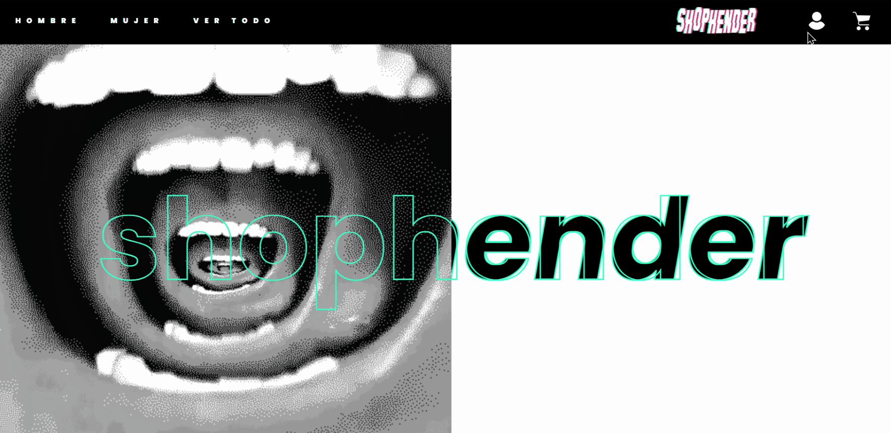

# [shophender 🚀](https://shophender.vercel.app)

This project consists of an ecommerce developed in React JS (using Create React App) together with Firebase and Stripe. Deployed in production with Vercel ▲. Click on the title to go to the website ❗

## User Story 🙋

A user can enter the store, register, browse the different products 👕 👖 👞 , go to their details, add and remove products from the cart and make a purchase 💸. When the latter happens, the purchase is stored in the database and feedback is given on the order number 📃.

## Firebase 🔥 

### Cloud Firestore

The project uses Cloud Firestore mainly to manage two collections 📁. 

The first one, to store products that are shown to users in the different sections of the ecommerce.

In a second collection, the purchases made by the users are stored.

### Authentication

The site has an authentication implementation with email ✉️ and password 🔒 provided by Firebase Authentication.

## Responsive Design

The project has three dimensions. It was developed first for mobile 📱, then the tablet version 📟 is observed from 760 pixels, and after 1023 pixels the desktop version 💻.

## Stripe and Formik 💪 

I use Formik to handle the shipping data 🚚 and Stripe for the payment method 💳.

## Environment Variables ⚠️ 

If you want to run this project on your computer, you can ask me privately for environment variables for Firebase configuration. I will send you the .env file.

## Available Scripts

In the project directory, you can run:

### `npm start`

Runs the app in the development mode. 
Open [http://localhost:3000](http://localhost:3000) to view it in the browser.

The page will reload if you make edits. 
You will also see any lint errors in the console.

### `npm test`

Launches the test runner in the interactive watch mode. 
See the section about [running tests](https://facebook.github.io/create-react-app/docs/running-tests) for more information.

### `npm run build`

Builds the app for production to the `build` folder. 
It correctly bundles React in production mode and optimizes the build for the best performance.

The build is minified and the filenames include the hashes. 
Your app is ready to be deployed!

See the section about [deployment](https://facebook.github.io/create-react-app/docs/deployment) for more information.

### `npm run eject`

**Note: this is a one-way operation. Once you `eject`, you can’t go back!**

If you aren’t satisfied with the build tool and configuration choices, you can `eject` at any time. This command will remove the single build dependency from your project.

Instead, it will copy all the configuration files and the transitive dependencies (webpack, Babel, ESLint, etc) right into your project so you have full control over them. All of the commands except `eject` will still work, but they will point to the copied scripts so you can tweak them. At this point you’re on your own.

You don’t have to ever use `eject`. The curated feature set is suitable for small and middle deployments, and you shouldn’t feel obligated to use this feature. However we understand that this tool wouldn’t be useful if you couldn’t customize it when you are ready for it.

## thank you very much for coming! ✌️ 